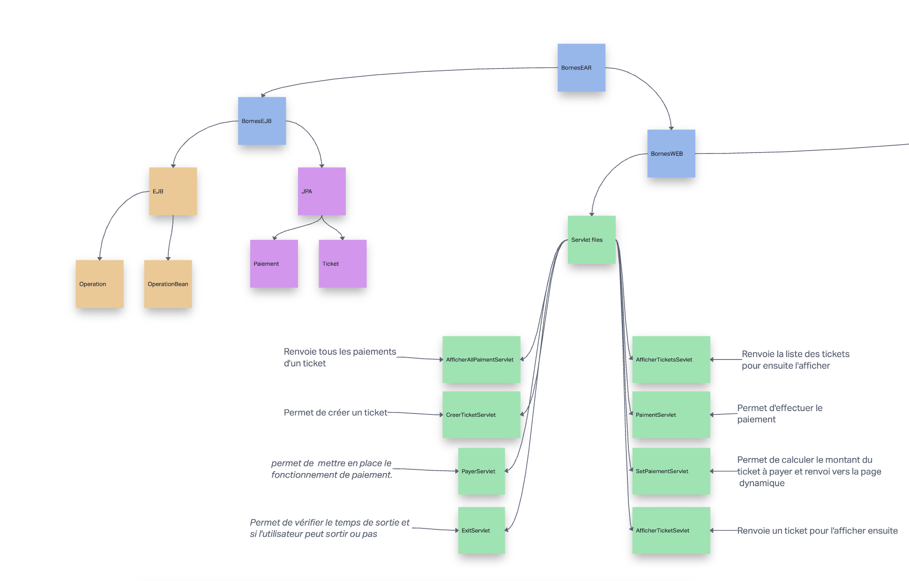
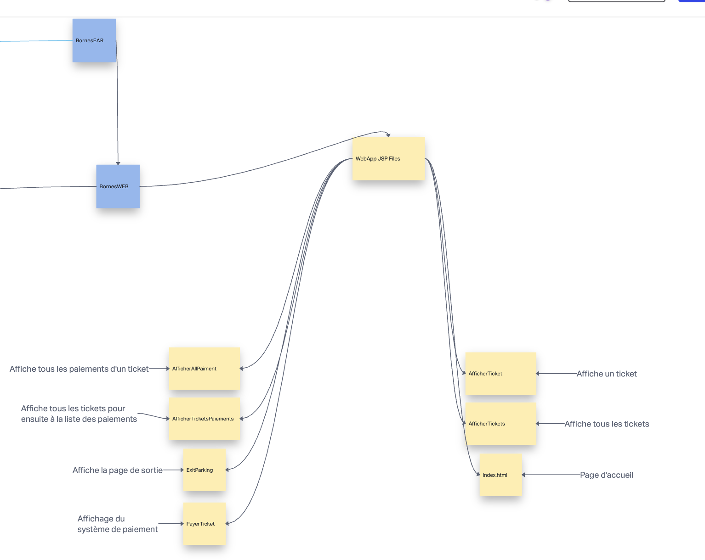

# TP INFO706 Parking readme

Projet réalisé par les étudiants en master 1 Informatique a l’université Savoie mont Blanc :

- Paul DELIFER
- Huseyin YURTSEVEN

Lien vers le dépôt initial comportant le sujet du TP ainsi que des explications sur le fonctionnement des bornes : [https://gitlab.com/info706_jee/Sujet_TP](https://gitlab.com/info706_jee/Sujet_TP)

## Les technologies utilisees

Lors du développement du TP, nous avons utilisé principalement le langage **Java** avec **Java EE** ainsi que le framework **bulma** pour la mise en place des styles des pages web.

En ce qui concerne du serveur, nous avons utilisé **Payara**, lancer à partir d’un **Docker**.

## Nos choix d’implementations

Nous avons décidé d’utiliser le système EAR.

Notre projet est regroupé en trois dossiers :

- BornesEAR
- BornesEJB
- BornesWEB


Pour modifier le délai de paiement gratuit pour le ticket, il faut modifier les fichiers suivant la variable DiffMinutes : 

- Fichier Ticket.java
- ExitServlet.java

### BornesEJB :

---

Ce dossier contient les deux JPA (Ticket et Paiement) ainsi que l’EJB SESSION avec les deux fichiers Operations.java et OperationsBean.java.

### BornesWEB :

---

Le dossier BornesWEB contient la totalité de nos Servlet ainsi que nos pages JSP et la page d’accueil HTML.

Voici deux images expliquant le fonctionnement de notre système : 





## Comment utiliser l'application ?

- Cloner le git sur votre machine
- Importer le dossier dans un IDE

```bash
docker-compose up
```

- La commande ci-dessus permettra de mettre en place le docker et de lancer Payara
- Il faudra exécuter notamment la commande

```bash
./gradlew build
```

- La commande ci-dessus va créer un fichier .ear qui sera ensuite à déployer sur le serveur Payara
- Pour le déploiement, il faudra dans un premier temps se diriger vers le lien
- localhost:4848
- User : admin
- Password : admin
- Aller dans la section “déployer une application”
- Rentrer le chemin suivant : /opt/payara5/glassfish/domains/domain1/autodeploy/BornesEar.ear
- Se diriger vers la page localhost:8080/BornesWeb
- À vous de gérer le parking 😉🏎

## Documentation :

Java EE 7 (Oracle)

- Doc : http://docs.oracle.com/javaee/7
- Tutoriel : https://docs.oracle.com/javaee/7/tutorial
- API (javadoc) : http://docs.oracle.com/javaee/7/api
- Spécifications : https://www.oracle.com/java/technologies/javaee/javaeetechnologies.html#javaee7

Jave EE 8 (Oracle)

- Doc : https://javaee.github.io/glassfish/documentation
- Tutoriel : https://javaee.github.io/tutorial/
- API (javadoc) : https://javaee.github.io/javaee-spec/javadocs/
- Spécifications : https://www.oracle.com/java/technologies/javaee/javaeetechnologies.html#javaee8
- Serveurs compatibles : https://www.oracle.com/java/technologies/compatibility-jsp.html

Jakarta EE 8 (Fondation Eclipse)

- Doc : https://javaee.github.io/glassfish/documentation
- Tutoriel : https://javaee.github.io/tutorial/
- API (javadoc) : https://jakarta.ee/specifications/platform/8/apidocs/
- Spécifications : https://jakarta.ee/specifications
- Serveurs compatibles : https://jakarta.ee/compatibility/certification/8/

Jakarta EE 9 (Fondation Eclipse)

- Doc : https://jakarta.ee/resources/#documentation
- Tutoriel : https://eclipse-ee4j.github.io/jakartaee-tutorial/
- API (javadoc) : https://jakarta.ee/specifications/platform/9/apidocs/
- Spécifications : https://jakarta.ee/specifications
- Serveurs compatibles :
  - https://jakarta.ee/compatibility/certification/9/
  - https://jakarta.ee/compatibility/certification/9.1/

Jakarta EE 9 (Fondation Eclipse)

- Doc : https://jakarta.ee/resources/#documentation
- API (javadoc) : https://jakarta.ee/specifications/platform/10/apidocs/
- Spécifications : https://jakarta.ee/specifications
- Serveurs compatibles :
  - https://jakarta.ee/compatibility/certification/10/